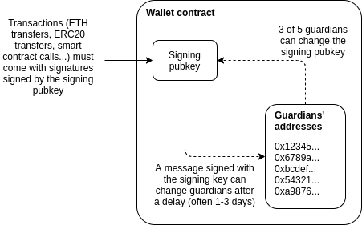
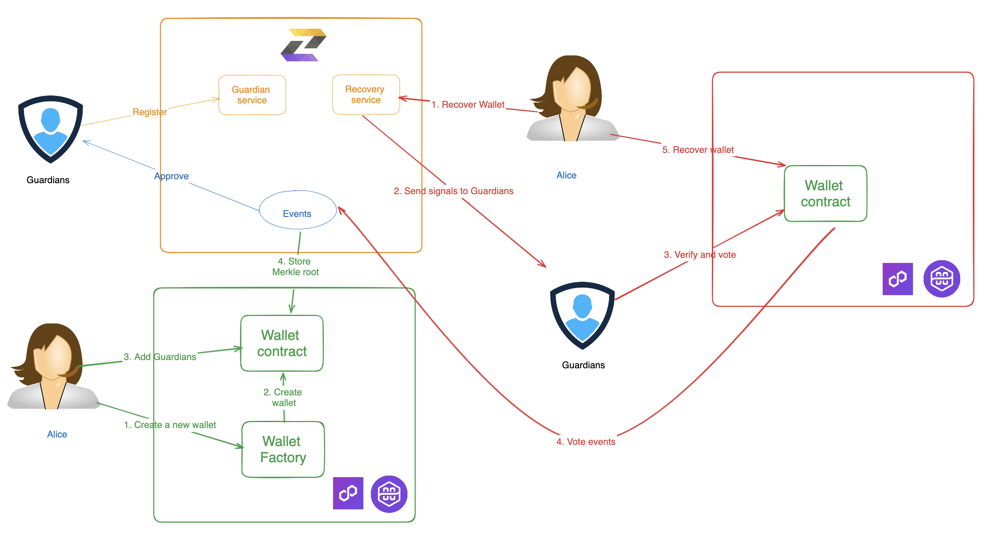

# Proof Generation EVM/zkEVM

The purpose of this repository is to describe the architecture and process for integrating ZK Keyless Wallet's Zero Knowledge Proof wallet technology with EVM/zkEVM Chain. It outlines how we can generate proofs offchain.

# Background

## What is social recovery
Social recovery is a technique used in smart contract wallets that allows users to grant trusted individuals the ability to restore access to their accounts. It serves as a safety net in case users get locked out of their accounts, enabling them to regain access through the assistance of trusted parties.

In a [post](https://vitalik.ca/general/2021/01/11/recovery.html) Vitalik discussed the importance of wider adoption of social recovery wallets. While multi-signature wallets have been commonly used for secure fund custody, they require coordination among multiple parties for transactions. On the other hand, single-key wallets like Metamask can lead to fund loss if the private key is lost or stolen. Social recovery wallets address these issues.

Social Recovery wallets are designed to mitigate against two scenarios: 
1. Loss of the user's private key
2. Theft of the user's private key by a hacker

The following diagram illustrates the flow of a social recovery wallet, where a single owner can sign transactions, and a set of guardians can change the owner (signing key).



## Our approach
The previous approach involved storing the Ethereum address of the guardian in plain text on-chain. Our goal is to keep the guardian address private while still enabling social recovery functionality.

To achieve this, we use the zero-knowledge addGuardians() function with Semaphore when a user adds a guardian. Semaphore is a solution that allows Ethereum/zkEVM chain users to prove their group membership and send signals without revealing their original identity.


# Overview


# Guardian service
Steps for Guardians
1. Register as a guardian on our website.
2. Sign with a wallet (e.g., Metamask) to create an identity commitment.
3. Official guardians will undergo a KYC process and approval to be added to our system.
4. The guardian's commitment will be stored in the Guardian smart contracts using a Guardian Merkle Tree.

# Recovery Service
**Pre setup:**
1. Users must add a minimum of three guardians to their smart contract wallet.
2. A Semaphore group (Guardian Group) will be created within the user's smart contract wallet.
3. Guardians will be added as members of the Semaphore group.

**Recover wallet proces:**
1. The user initiates a recovery process, either due to losing their mobile phone and needing access or a nominee initiating the process after the user's passing to recover funds to a new wallet.
2. Our recovery service verifies the user's identity and begins the recovery process by sending events/messages to the user's guardians.
3. Guardians vote on the recovery process.
4. If the total votes reach 50%+1 (this threshold can be set by the user during the initial setup), the user can update the smart contract wallet with their identity (e.g., Google Auth), and the Merkle Root of their wallet will be updated.


# Semaphore
What Is Semaphore?
Overview
Semaphore is a zero-knowledge protocol that allows you to cast a signal (for example, a vote or endorsement) as a provable group member without revealing your identity. Additionally, it provides a simple mechanism to prevent double-signaling. Use cases include private voting, whistleblowing, anonymous DAOs and mixers.

Features
With Semaphore, you can allow your users to do the following:

Create a Semaphore identity.
Add their Semaphore identity to a group (i.e. Merkle tree).
Send a verifiable, anonymous signal (e.g a vote or endorsement).
When a user broadcasts a signal (for example: a vote), Semaphore zero-knowledge proofs can ensure that the user has joined the group and hasn't already cast a signal with their nullifier.

Semaphore uses on-chain Solidity contracts and off-chain JavaScript libraries that work in tandem.

Off chain, JavaScript libraries can be used to create identities, manage groups and generate proofs.
On chain, Solidity contracts can be used to manage groups and verify proofs.


## Semaphore proof
Semaphore proofs
Once a user joins their Semaphore identity to a Semaphore group, the user can signal anonymously with a zero-knowledge proof that proves the following:

the user is a member of the group,
the same user created the signal and the proof.

## Generate a proof off-chain
Use the @semaphore-protocol/proof library to generate an off-chain proof. To generate a proof, pass the following parameters to the generateProof function:

identity: the Semaphore identity of the user broadcasting the signal and generating the proof;
group: the group to which the user belongs;
externalNullifier: the value that prevents double-signaling;
signal: the signal the user wants to send anonymously;
snarkArtifacts: the zkey and wasm trusted setup files.

In the voting system use case, once all the voters have joined their identities to the ballot group, a voter can generate a proof to vote for a proposal. In the call to generateProof, the voting system passes the unique ballot ID (the Merkle tree root of the group) as the externalNullifier to prevent the voter signaling more than once for the ballot. The following code sample shows how to use generateProof to generate the voting proof:

```typescript
import { generateProof } from "@semaphore-protocol/proof"

const externalNullifier = group.root
const signal = 1

const fullProof = await generateProof(identity, group, externalNullifier, signal)
```

Verify a proof on-chain
Use the Semaphore.sol contract to verify proofs on-chain.
To verify Semaphore proofs in your contract, import ISemaphore.sol, pass it the Semaphore.sol address and call the verifyProof method with following parameters:

groupId: the identifier of the group;
merkleTreeRoot: the root of the Merkle tree;
signal: the signal the user wants to send anonymously;
nullifierHash: a nullifier hash;
externalNullifier: the value that prevents double-signaling;
proof: a Solidity-compatible Semaphore proof.

Resources:
- [Semaphore](https://semaphore.appliedzkp.org/docs/introduction)